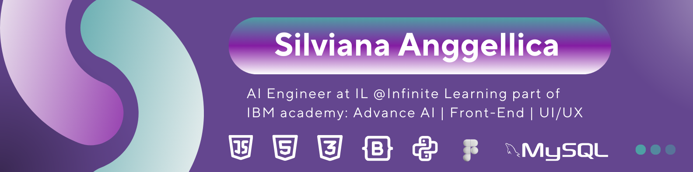

<!-- Banner Image -->

  

---

## Hi there! 👋 I'm Silviana Anggellica, 

### 🚀 About Me:
Hi, I'm Silviana Anggellica. My usual nickname is Angel. I am a final year student in the Informatics study program, at Singaperbangsa University in Karawang.

I am currently an AI Engineer at Infinite Learning Indonesia, specifically at IBM Academy: AAI. My skills are Front End can use react, I can design UI/UX according to user preferences, I can also use Google Collab or Jupyter Notebook as tools for Python. Python libraries that I often use are Numpy, Pandas, and many more for data-related lecture assignments.

---

### 🛠️ Skills:

#### 👨‍💻 Programming Languages:

  
  
  

#### 💻 Front-End Development:

  
  
  
  

#### 🤖 AI/ML:

  
  
  
  
  

#### 🗄️ Databases:

  

#### 🛠️ Tools:

  
  
  

#### 🌐 Social:

  
  

---

### 📊 GitHub Stats:

### 📚 Top Languages:

### 📅 Weekly Coding Activity:
<!-- You can use GitHub Profile Trophy or GitHub Readme Streak Stats to show coding activity -->

---